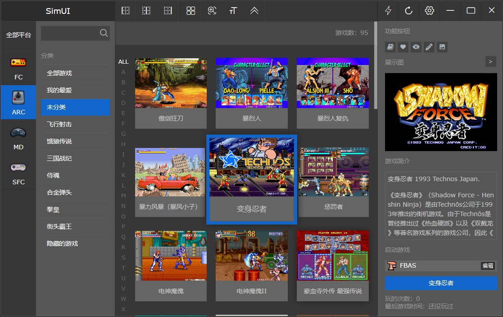

**SimUI是一款绿色、轻量级、配置自由的模拟游戏ROM管理软件。**

软件支持自由添加游戏平台、支持多游戏模拟器、多游戏目录； 

支持ROM别名，ROM子游戏； 

支持多种展示图、场景展示视频、支持gif动画；  

支持游戏简介、游戏攻略，支持富文本显示，支持txt、markdown、html三种语法，并可以混合运用；  

支持自定义皮肤、支持多语言；

还支持懒加载、软件改名、一键下载缩略图、快捷工具等诸多功能。




&nbsp;
## 软件地址

[www.simui.net/](http://www.simui.net/)


## 编译工具

静态资源编译工具：

`packfolder.bat`

编译测试包：

`build/build_dev.bat`

编译64位系统正式包：

`build/build_product_64.bat`

编译32位系统正式包（需在32位系统下执行）：

`build/build_product_32.bat`


## 部署方法

1. clone本项目
2. 将simUI完整二进制项目放进项目app目录
3. 根据环境情况配置 main.go文件中的`isDebug`变量，是否开启调试模式
4. 执行`build/build_dev.bat`编译项目
5. 生成app/sciter-64.exe文件完成，启动项目


## 代码结构

```
.
├── config                      # 配置
│   └── config.go               # 项目配置包
├── controller                  # 控制器（业务入口）
│   ├── Cache.go                # 缓存
│   ├── Config.go               # 配置
│   ├── Menu.go                 # 菜单
│   ├── Platform.go             # 平台
│   ├── Public.go               # 公共函数
│   ├── Rom.go                  # 游戏rom
│   ├── RomCmd.go               # 游戏单一模拟器参数
│   ├── Shortcut.go             # 快捷工具
│   └── Simulator.go            # 模拟器
├── db                          # 数据库module
│   ├── config.go               # 配置表
│   ├── db.go                   # 初始化方法
│   ├── menu.go                 # 菜单表
│   ├── platform.go             # 平台表
│   ├── rom.go                  # rom表
│   ├── shortcut.go             # 快捷工具表
│   ├── simconf.go              # rom表（rom表的模拟器配置）
│   └── simulator.go            # 模拟器表
├── go.mod
├── go.sum
├── main.go                      # 入口函数
├── modules                      # 功能模块
│   ├── Backup.go                # 备份恢复相关方法
│   ├── Rom.go                   # rom相关方法
│   ├── RomCache.go              # rom缓存相关方法
│   ├── RomRename.go             # rom重命名相关方法
│   ├── menu.go                  # 菜单相关方法
│   ├── simulator.go             # 模拟器相关方法
│   ├── thumb.go                 # 缩略图相关方法
│   ├── upgrade.go               # 软件更新相关方法
│   └── zip.go                   # 压缩相关方法
├── res.go                       # 静态资源打包文件
├── res.syso                     # 静态资源syso
├── utils                        # 公共方法
│   ├── conv.go                  # 数据转换方法
│   ├── encode.go                # 编码方法
│   ├── file.go                  # 文件方法
│   ├── filepath.go              # 路径方法
│   ├── http.go                  # http方法
│   ├── rom.go                   # 游戏相关方法
│   ├── slice.go                 # 切片方法
│   └── string.go                # 字符串方法
│   ├── pinyin                   # 拼音转换库
│   │   ├── ...
│   ├── sciter                   # go-sciter库
│   │   ├── ...
└── view                         # 视图
│    ├── about.html              # 关于页面
│    ├── add_platform.html       # 添加平台页面
│    ├── config.html             # 配置页面
│    ├── desc.html               # 攻略页面
│    ├── down_thumbs.html        # 下载缩略图页面 
│    ├── edit_rom_cmd.html       # 编辑模拟器参数页面
│    ├── edit_sim.html           # 编辑模拟器页面
│    ├── edit_thumbs.html        # 编辑缩略图页面
│    ├── main.html               # 首页
│    ├── rom_rename.html         # 重命名页面
│    └── tis                     # 脚本
│    │   ├── event.tis           # 公共事件
│    │   ├── keycode.tis         # 键盘快捷键
│    │   ├── menu.tis            # 菜单
│    │   ├── platform.tis        # 平台
│    │   ├── rom.tis             # rom
│    │   ├── sidebar.tis         # 侧边栏
│    │   ├── statebar.tis        # 状态栏
│    │   ├── thumb.tis           # 缩略图
│    │   ├── utils.tis           # 公共方法
│    │   └── window.tis          # 窗体相关
│    │   ├── context.tis         # 右键菜单
│    │   ├── dialog              # 子页面脚本
│    │   │   ├── config.tis      # 配置
│    │   │   ├── desc.tis        # 攻略
│    │   │   ├── down_thumbs.tis # 下载缩略图
│    │   │   ├── edit_sim.tis    # 编辑模拟器
│    │   │   ├── edit_thumbs.tis # 编辑rom模拟器参数
│    │   │   └── rom_rename.tis  # 重命名
│    │   ├── plugins             # sciter插件
│    │   │   ├── decorators.tis  # 快捷键支持
│    │   │   ├── dragdrop.tis    # 拖拽换图
│    │   │   ├── markdown.tis    # markdown
│    │   │   ├── rotator.tis     # 滑动焦点图
│    │   │   ├── tabs.tis        # tab
│    │   │   └── vlist.tis       # 列表
│    ├── images                  # 图片资源
│    │   ├── *.jpg/png           # 图片资源
│    │   ├── iconfont.ttf        # 字体图标
│    │   ├── public.css          #  样式文件
```


simUI二进制包目录结构

```
── app
│   ├── data.dll        # sqlite数据库文件
│   ├── sciter-32.dll   # sciter32位引擎
│   ├── sciter-64.dll   # sciter64位引擎
│   ├── sciter-32.exe   # simIO32位执行文件
│   ├── sciter-64.exe   # simUI64位执行文件
│   ├── theme           # 主题目录
│   │   ├── *.css       # 主题css文件
│   │   ├── *.png/jpg   # 主题相关图片文件
│   ├── icons           # 平台图标目录
│   │   ├── *.ico
│   ├── lang            # 语言
│   │   ├── 简体中文.ini  # 简体中文语言文件
│   │   └── 繁体中文.ini  # 繁体中文语言文件
```

